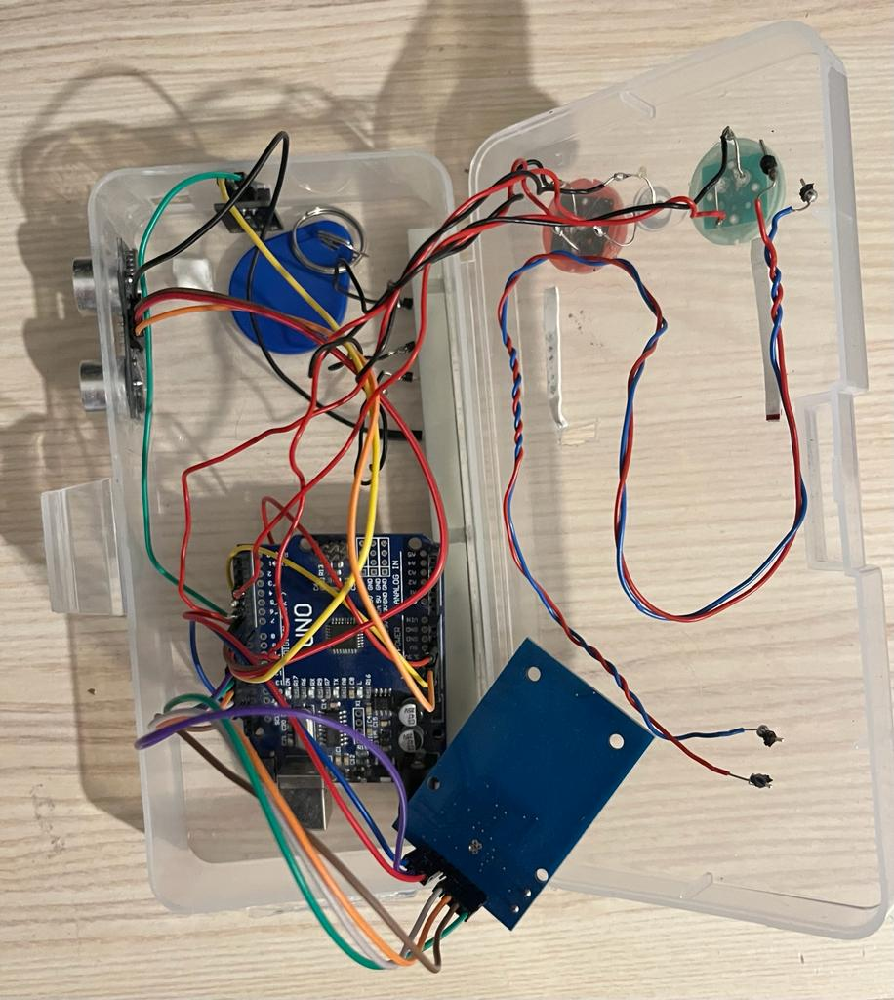
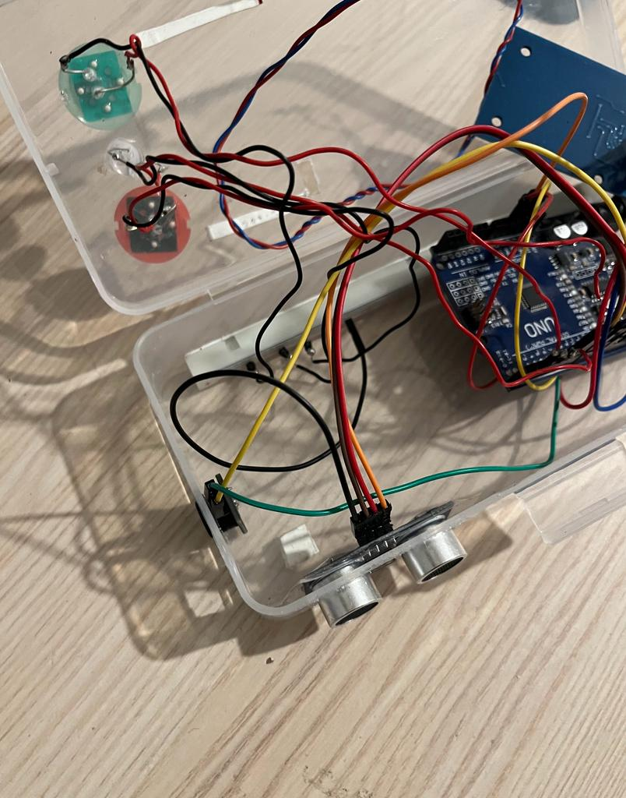

# Arduino




NFC

### Probleme:

- Unten bei der Loop geht der Code einfach weiter wenn der Alarm ausgelöst wird
- rote und grüne lampe scheinen Kaputt zu sein

### Lösung:

- Ich könnte einen Ton abspielen und dann abchecken ob der Nfc Tag vorhanden ist, dann wieder Ton dann wieder Abchecken und das in einer Loop Schleife

### Probleme:

-nach dem der Alarm ausgelöst wird, geht er einfach weiter Lösung: ich könnte einen Ton abspielen und dann checken ob NFC tag vorhanden ist und das in einer while Loop, dadurch kann auch so ein Alarm ton entstehen

- SDA 10 D PWM
- SCK 13 D
- MOSI 11 D PWM
- MISO 12 D

```sh

```

SPEAKER

- -D9

LED

- Green: 2 D
- White: 4 D
- Red: 7 D
